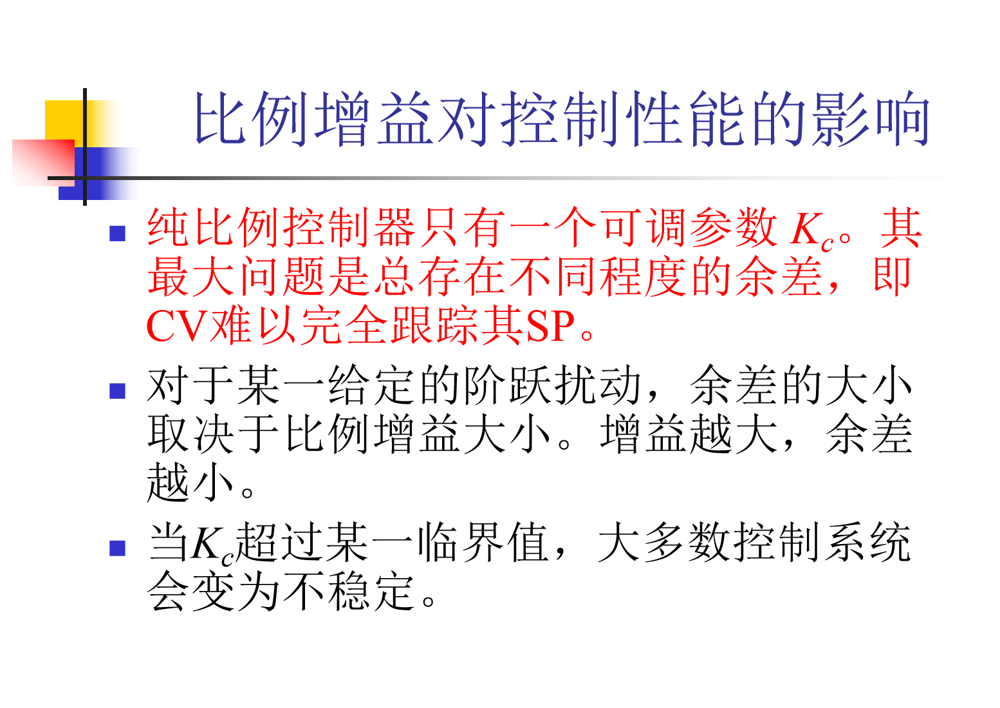
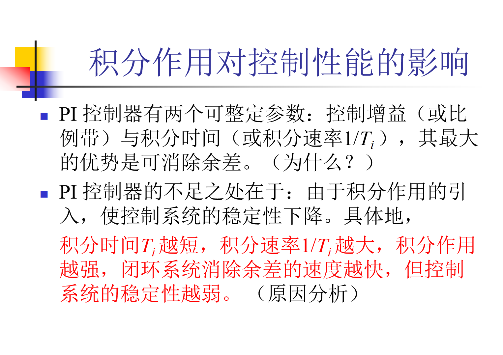
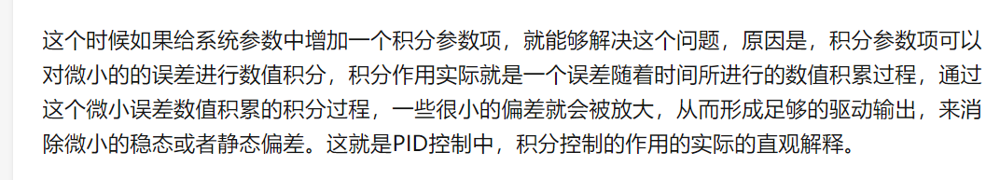
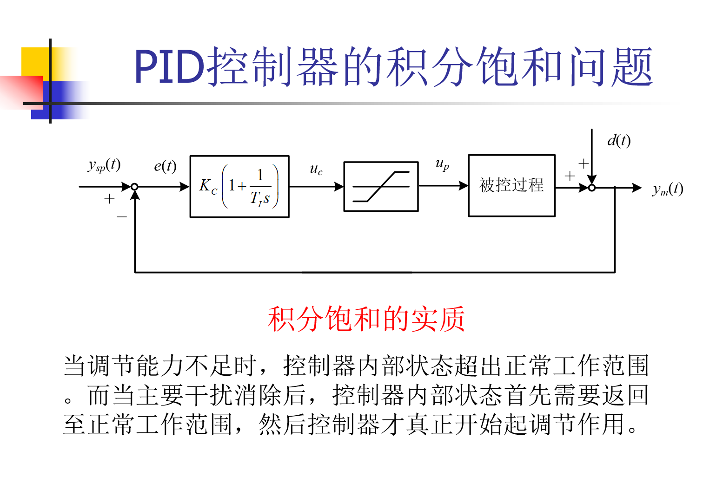
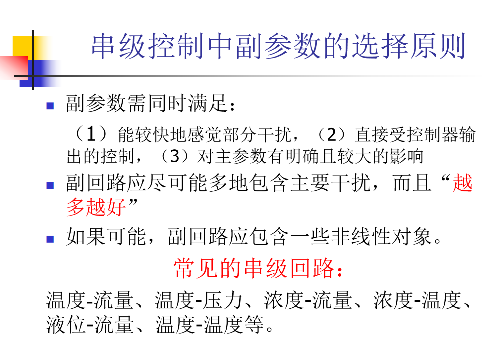
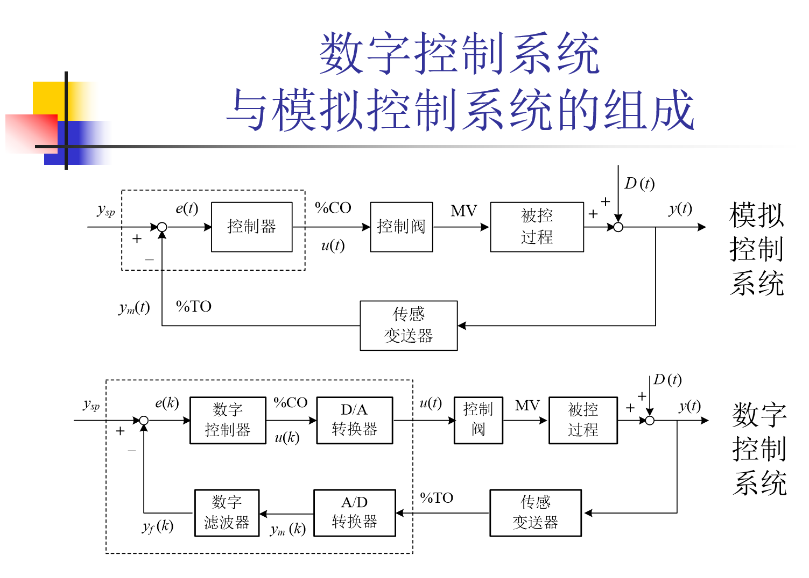

# 控制工程1

积分作用

PID中，Kc增大，三种作用同时增大

一型系统，非自衡对象，用脉冲输入进行测试，不能用阶跃测试，幅度尽可能大，时间尽可能小，经过1/s积分环节后相当于阶跃输入

二型，用幅度相同的正反向脉冲，把1/s2移到前面，e.g.：扭矩-角速度-位移控制

工艺介质流量增大，相当于流速增大，加热时间变小，温度降低 

气开气关选择就是根据无气源，u=0时候的情况进行选择

u（t）增大，因为是气开，开度增大，燃料气增大，Tm增大，对象正作用，所以要反作用

串级控制有前馈的效果，工程上能用串级不用前馈

选择副参数：左右上

串级和前馈不同，串级能控制副参数达到控制效果，前馈不能

副回路应尽可能多地包含主要干扰，而且“越多越好”，而且要“越早越好”

工程上先进行中值滤波，再进行平均滤波，平均滤波适用于波动比较小的数据，中值滤波可以滤数据满量程

原来输出是uk，现在是uk=uk-1+$$\Delta$$uk，因此输入信号发生了变化，uk=PID（ysp（k-2，...，k），y（k-2，...，k），uk-1）

当ek不变时，只剩下了积分作用，$$\Delta$$uk=Kc/Ti*Ts * ek

会存在积分饱和现象

当控制器输出有人工控制时候，PID控制最好不要超过当前，只是一个增量

u3k=uk+$$\Delta$$uk+f(PID)

集散：集中管理，分散控制

复习：

1.对象特性的建模：水罐、倒立摆，了解建模方程大概，水罐物料平衡；过程对象的测试建模法，阶跃建模法；调节阀的气开气关，控制器的正反作用，定义、判断与解释；广义对象理解，广义对象的K,T,tao的求取，结合阶跃响应法

2.特殊对象的PID参数的整定，（PID、PI），非自衡对象整定，液位、流量对象整定的原则

3.串级控制，画方块图，反馈一定形成回路

4.前馈，知道概念就好

5.机器人建模

6.数字PID公式推导

